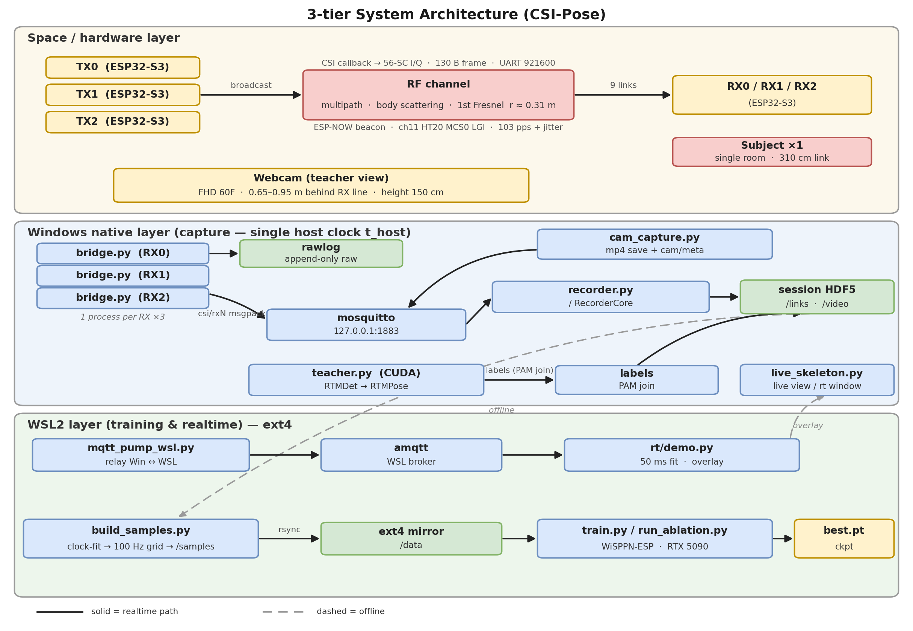

# WiPose

**Development history:** Developed locally before publication. These repositories were uploaded together, so their GitHub publication dates do not indicate when development began.

**WiFi channel measurements into 18-joint pose estimates.**

The pipeline includes ESP32-S3 firmware, CSI capture and synchronization, teacher labeling, model training, and real-time pose/fall visualization. The existing modules, formats, parameters, and firmware remain intact.

## Set up

Use the [complete setup and operating guide](docs/REFERENCE.md#getting-started). The system expects six ESP32-S3 boards, appropriate serial links, an MQTT broker, and separately trained model weights. The teacher route uses webcam recordings and downloads third-party ONNX models when explicitly run.

```bash
python -m pip install -r requirements.txt
python wipose.py --help
# Original training options pass through unchanged:
python wipose.py train --help
```

`infer` delegates to the existing real-time demo; `label` delegates to teacher labeling. Those routes require configured data or hardware. Local verification did not launch capture, connect to boards/brokers, download teacher models, or train on human recordings.

## Recorded demonstration



The original recorded demonstrations, figures, quantitative results, and scope caveats remain in the [reference guide](docs/REFERENCE.md). They were not reproduced as part of this packaging work. Fall detection is a research demonstration, not a validated safety or medical system.

## Third-party components

The WiSPPN-derived model and teacher-model notices remain in [THIRD_PARTY_NOTICES.md](THIRD_PARTY_NOTICES.md) and in their source headers. The project license is retained in [LICENSE](LICENSE).

## Verification

See [the verification record](docs/VERIFICATION.md) for executed checks and unavailable hardware/model checks. Successful computational behavior is preserved; renamed commands add a presentation layer.

Maintained by [nazeeh111](https://github.com/nazeeh111).
